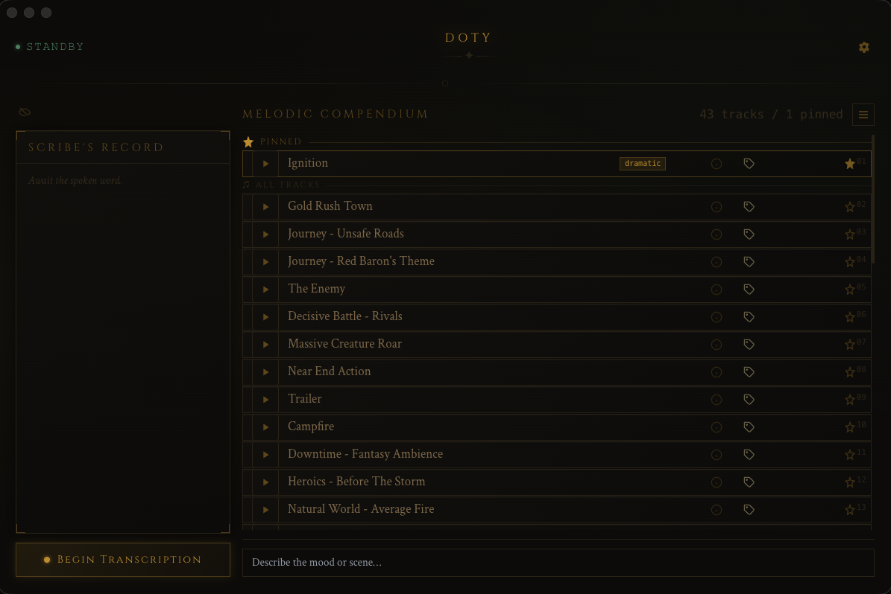

# Doty

AI-powered music companion for tabletop RPG sessions. Doty listens to your table through continuous speech-to-text, then picks the best matching tracks from your music library in real time — no cloud, no API keys, everything runs locally on your machine.

Named after the ever-faithful automaton scribe from Critical Role, Doty sits quietly at your table, listens, and acts.



## Features

### Real-time speech-to-text
Doty transcribes your game table continuously using Parakeet TDT v3 (via sherpa-onnx). It runs fully offline with Silero VAD for voice activity detection and GTCRN for speech denoising. You can add a hotwords file with campaign-specific names, spells, and places to improve transcription accuracy.

### AI music recommendations
As the conversation flows, Doty uses a cross-encoder model (ms-marco-MiniLM-L-6-v2) to score every track in your library against the rolling transcript and surfaces the best matches. Recommendations update automatically as the scene evolves.

### DM scene prompt
Type a scene description like "dark dungeon", "tavern celebration", or "dragon fight" into the prompt bar and Doty immediately re-ranks your library to match. The DM prompt takes priority over the transcript, so you can steer the mood at any time.

### Full music player
- Play, pause, seek, and volume control
- Music queue with drag-to-reorder
- Loop modes: off, single track, or loop queue
- Crossfade with configurable duration (0–5 seconds)
- Pin favourite tracks to the top of the soundboard
- Custom tags on tracks for organization and search
- Browse panel to search and filter your entire library
- Keyboard shortcuts: `N` next track, `P` previous track

### Discord bot integration
Stream your music directly to a Discord voice channel so remote players hear the same soundtrack. Doty connects as a bot, joins your voice channel, and mirrors local playback to Discord in real time with independent volume control.

### Transcript saving
Optionally save session transcripts to a folder of your choice. Transcripts are written automatically as the session progresses.

### Audio analysis
On first scan, Doty analyses every track in your library using essentia.js to extract BPM, key, danceability, and energy. This metadata is stored locally in SQLite and used to improve recommendations.

## Installation

### Download the app

Grab the latest `.dmg` from the [Releases](https://github.com/CodeAndJam/doty/releases) page, open it, and drag Doty to your Applications folder.

### Requirements

- macOS (Apple Silicon or Intel)
- ~800 MB disk space for AI models (downloaded on first launch)

### First launch

1. Open Doty. It will prompt you to download the **Parakeet TDT v3** ASR model (~640 MB). This is saved to `~/.doty/models/` and only happens once.
2. Open Settings (gear icon or `Cmd+,`) and set your **Music folder** — point it at your local music library (mp3, flac, wav, m4a, ogg, aac supported).
3. Doty will scan and analyse your tracks. This takes a few minutes on first run depending on library size.
4. The **MiniLM-L-6-v2** recommendation model (~80 MB) downloads automatically on the first recommendation and is cached to `~/.doty/hf-cache/`.

## User guide

### Basic workflow

1. Open Settings and select your **music folder** and **microphone**.
2. Click **Begin Transcription** to start listening.
3. Doty transcribes what it hears and automatically recommends matching tracks in the soundboard.
4. Click any track card to play it. Use the player bar at the bottom to control playback.
5. Type a scene description in the **prompt bar** at the bottom to manually steer recommendations.

### Settings

Open with the gear icon (top right) or `Cmd+,`.

| Setting | Description |
|---|---|
| Listening Device | Microphone used for transcription |
| Sound Conduit | Audio output device for playback |
| Music Archive | Folder containing your music files |
| Transcript Vault | Folder where session transcripts are saved |
| Arcane Lexicon | Hotwords file with campaign names to boost transcription accuracy |
| Recommendations | Number of tracks to suggest per query (1–20) |
| Crossfade | Fade duration between tracks (0–5 seconds) |

### Soundboard

The soundboard shows three sections:

- **Pinned** — your favourite tracks, always at the top. Click the pin icon on any track to pin/unpin it. Reorder pinned tracks with the arrow buttons.
- **Suggestions** — AI-recommended tracks based on the current transcript and/or DM prompt.
- **All Tracks** — everything else in your library.

Right-click or use the context menu on any track to:
- **Play Next** — insert it after the current track in the queue
- **Add to Queue** — append it to the end of the queue

### Queue

Click the queue icon in the player bar to open the queue panel. You can:
- Drag tracks to reorder
- Click to jump to any track
- Remove individual tracks
- Clear the entire queue

### Tags

Click the tag area on any track card to add custom tags (e.g. "combat", "tavern", "boss fight"). Tags help you organize and filter tracks in the browse panel. All tags are stored locally.

### Discord streaming

To stream music to a Discord voice channel:

1. **Create a Discord bot** — follow the [Kenku.fm guide](https://www.kenku.fm/docs/getting-a-discord-token) to create a bot application and get a token.
2. **Invite the bot** to your server with `Connect` and `Speak` permissions. In the Discord Developer Portal, go to OAuth2 > URL Generator, select scope `bot`, and check `Connect` + `Speak` under Bot Permissions.
3. **Set the token** in Doty — open Settings, scroll to the Discord section, paste your bot token, and click Connect.
4. **Select a server and voice channel**, then click Join.
5. Play any track in Doty — it will automatically stream to Discord.

The Discord volume slider (visible when in a voice channel) is independent from your local playback volume.

**Troubleshooting:**
- "Invalid token" — make sure you copied the Bot token (not the Application ID or Client Secret). Reset the token in the Developer Portal and copy it fresh.
- "Operation was aborted" when joining a channel — the bot lacks permission to join that channel. Add the bot to the channel's permissions with `View Channel`, `Connect`, and `Speak`.
- No audio in Discord — make sure a track is playing locally. Also check the bot's volume in your Discord client (right-click the bot in the voice channel).

## Development

### Prerequisites

- macOS (arm64 or x64)
- Node.js 24+ (see `.nvmrc`)
- pnpm

### Setup

```bash
# Install dependencies and rebuild native addons
pnpm install

# Run in dev mode (hot reload)
pnpm run dev

# Run unit tests
pnpm test

# Run e2e tests (requires a prior build)
pnpm run build && pnpm run test:e2e

# Test coverage
pnpm run test:coverage
```

### Native addons

`sherpa-onnx-node` and `better-sqlite3` are native C++ addons rebuilt against Electron's Node.js version automatically via the `postinstall` script. If you see a `NODE_MODULE_VERSION` mismatch error:

```bash
pnpm run rebuild
```

### Model files

| Model | Size | Location | Purpose |
|---|---|---|---|
| Parakeet TDT v3 (ONNX, int8) | ~640 MB | `~/.doty/models/` | Speech-to-text |
| ms-marco-MiniLM-L-6-v2 (ONNX) | ~80 MB | `~/.doty/hf-cache/` | Track recommendation reranking |

These are downloaded on first use and never committed to the repository.

### Project structure

```
electron/           Electron main process
  main.ts           App entry, IPC handlers, window management
  asr.ts            Speech-to-text orchestration
  asr-worker.ts     STT worker (sherpa-onnx, VAD, denoiser)
  discord.ts        Discord bot client (connect, voice, streaming)
  discord-audio.ts  Audio transcoding pipeline (ffmpeg -> Opus)
  database.ts       SQLite database for track metadata and tags
  scanner.ts        Music folder scanner and watcher
  analyzer.ts       Audio feature extraction (essentia.js)
  store.ts          Persistent settings (electron-store)
  preload.ts        Preload script exposing IPC to renderer

src/                React renderer
  App.tsx           App shell (model download gate)
  components/
    MainLayout.tsx  Main screen layout
    Soundboard.tsx  Track list with pinned/suggested/all sections
    PlayerBar.tsx   Playback controls, seek bar, volume
    QueuePanel.tsx  Drag-to-reorder queue
    BrowsePanel.tsx Full library browser with search
    TrackCard.tsx   Individual track row
    Settings.tsx    Configuration modal
    DiscordPanel.tsx Discord connection UI
    Transcript.tsx  Live transcript display
    TagInput.tsx    Tag editor component
  hooks/
    useAudioPlayer.ts  Audio playback engine
    useQueue.ts        Queue state management
    useRecorder.ts     Microphone recording
    useQwen.ts         Recommendation model interface
    useCrossfade.ts    Crossfade settings
```

### Architecture

| Layer | Technology |
|---|---|
| UI | React 18 + Tailwind CSS (Electron renderer) |
| Build | electron-vite 5 + Vite 7 |
| STT | sherpa-onnx-node (Parakeet TDT v3 int8) |
| VAD | Silero VAD (via sherpa-onnx) |
| Denoiser | GTCRN (via sherpa-onnx) |
| Punctuation | CT-Transformer (via sherpa-onnx) |
| Recommendations | @huggingface/transformers (ms-marco-MiniLM-L-6-v2) |
| Audio analysis | essentia.js + ffmpeg-static |
| Database | better-sqlite3 |
| Discord | discord.js + @discordjs/voice + prism-media |
| Process isolation | Electron `utilityProcess` (separate heap for ASR and reranker) |

### Building a DMG

```bash
pnpm run dist
```

Produces a macOS DMG in `dist/`.

### Release process

Releases are fully automated via [release-please](https://github.com/googleapis/release-please):

1. Every merge to `main` is analysed by release-please based on [Conventional Commits](https://www.conventionalcommits.org/).
2. It opens (or updates) a Release PR with a generated `CHANGELOG.md` and version bump.
3. When the Release PR is merged, a GitHub Release and tag are created.
4. The `build-dmg` workflow triggers on the new tag and uploads the macOS DMG as a release asset.

You never manually edit `CHANGELOG.md` or bump versions in `package.json`.

### Contributing

1. Fork the repo and create a branch: `feat/<name>`, `fix/<name>`, or `chore/<name>`.
2. Commit using [Conventional Commits](https://www.conventionalcommits.org/) format (see `AGENTS.md` for details).
3. Keep PRs focused — one logical change per PR.
4. All tests must pass before merging.
5. PR titles must follow Conventional Commits format (used as the squash commit message).

```
feat(soundboard): add keyboard shortcuts for playback
fix(asr): handle empty transcript from sherpa-onnx
chore(deps): bump sherpa-onnx-node to 1.13.0
```

## Privacy

Doty runs entirely on your machine. No audio, transcripts, or music data ever leaves your computer. The only network requests are:
- One-time model downloads on first launch (from Hugging Face and GitHub)
- Discord bot connection (only if you configure it)

## License

[MIT](LICENSE) — Copyright (c) 2026 CodeAndJam
